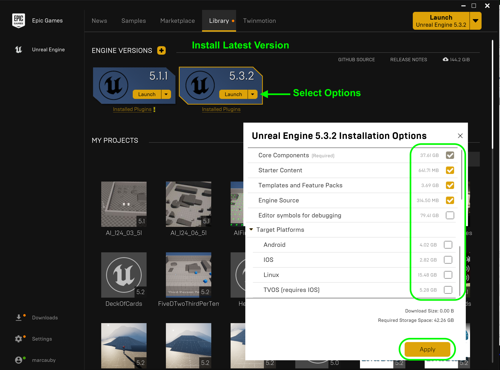
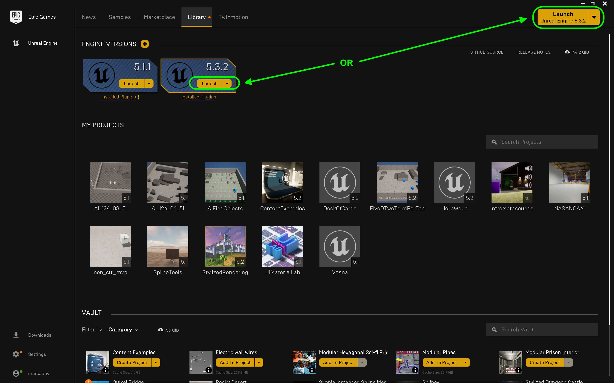
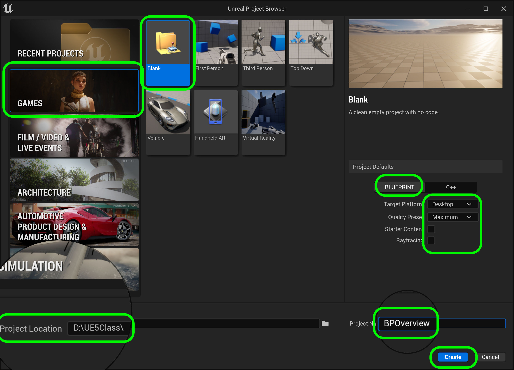
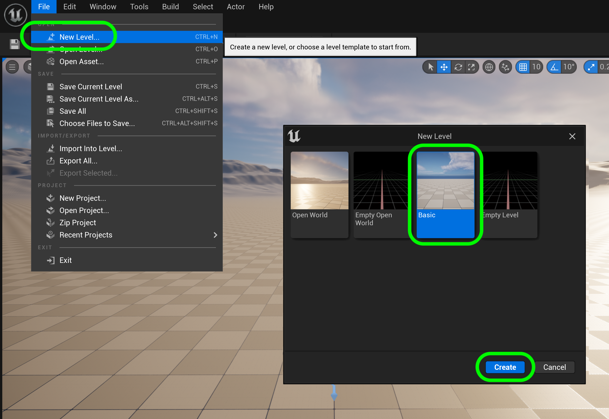
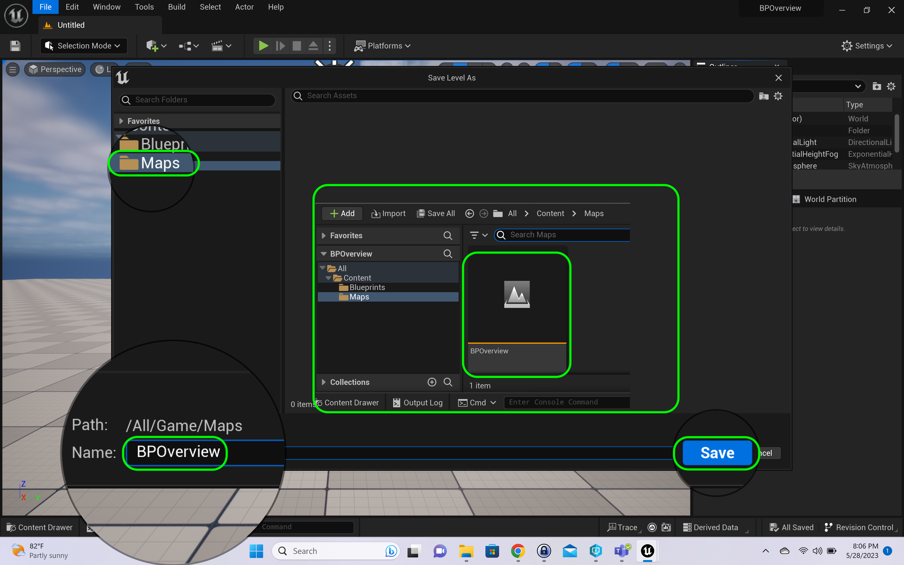
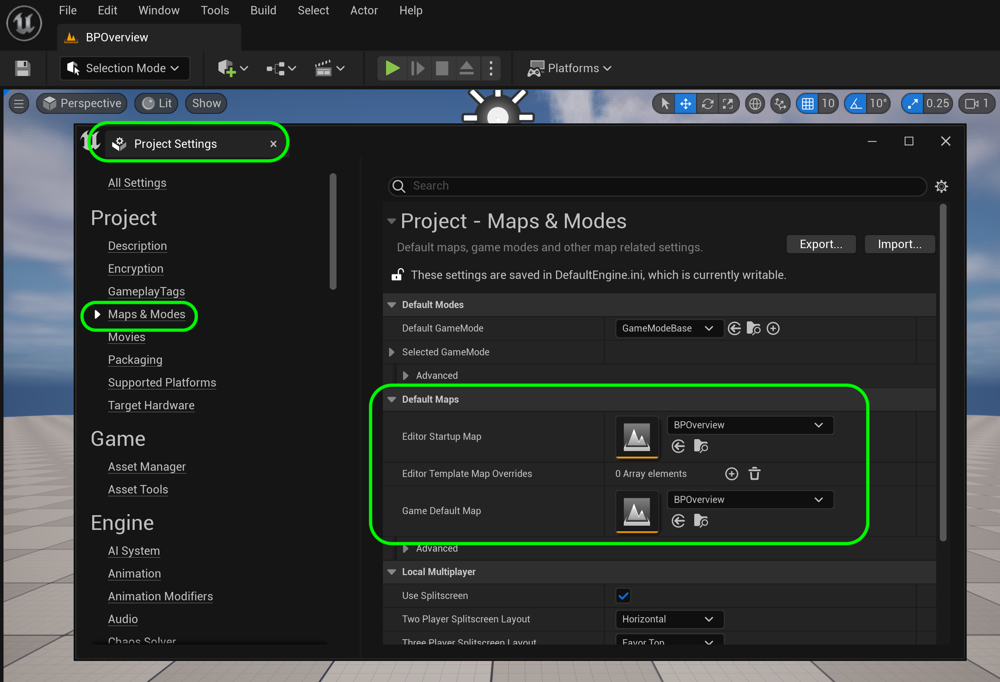

### Setting Up Unreal

[home](../README.md#user-content-ue5-bp-overview) • [next](../data-types/README.md#user-content-blueprint-data-types)

It is easiest to manage the various versions of Unreal using the **Epic Launcher**.  Thi allows you to install and run multiple versions of the engine.  Go to [Epic Launcher Download](https://store.epicgames.com/en-US/download) and install the Epic Game Launcher.  From here we will manage our game assets and resources. Intall Unreal 5.3.X and use a PC.

 

---

##### `Step 1.`\|`BPOVR`|:small_blue_diamond:

You will need to have an account with Epic games, but don't worry they are free to register for.  Unreal Engine 5 is freely available for students.

Once you have installed the launcher run the program and select **Unreal Engine** on the side menu and **Library** on the top menu. Press the **+** button to add a new build (if needed) and select the latest version.  In my case it is `5.3.X`. Make sure it is of version `5.3.x` if you want to ensure that you are compatible with this walk through (the third digit should work as these represent non-breaking changes to the engine and just bug-fixes).

Also, before installing select **Options** and only download platforms you need support (PC is built in).  So I saved some space by removing hand held versions of the engine. We also do not need the **Editor symbols for debugging** yet so we can save ~60 gigs here by not including it.  You can add these at any time in the future.

##### `Step 2.`\|`BPOVR`|:small_blue_diamond: :small_blue_diamond: 

Now once it installs press the **Launch** button on the **5.3.X** version of Unreal.

##### `Step 3.`\|`BPOVR`|:small_blue_diamond: :small_blue_diamond: :small_blue_diamond:

This brings up the **Unreal Project Browswer** window.  This allows you to select templates with the key assets already implemented.  We will select from the **Games** templates a **Blank** project. We will start with a **Blueprint** project.  Leave the quality at **Maximum Quality**, **Raytracing** disabled, a target platform of **Desktop** and we have **No Starter Content**. Then select a folder and call the project `BPOverview`. Press the **Create** button.

##### `Step 4.`\|`BPOVR`|:small_blue_diamond: :small_blue_diamond: :small_blue_diamond: :small_blue_diamond:

You should get to a project screen with an **Untitled** map with some elements already placed for you in the **World Outliner**.  Now even though we selected a blank template, Unreal gives you a whole set of base functionality out of the gate. 

##### `Step 5.`\|`BPOVR`| :small_orange_diamond:

Now **Unreal's** default level is one that supports large level streaming.  This is not necessary in our case.  Select **File | New Level...** and select a **Basic** level and press the <kbd>Create</kbd> button.

##### `Step 6.`\|`BPOVR`| :small_orange_diamond: :small_blue_diamond:

Select the **Content Drawer** and right click on **Content** and create two folders, on called `Maps` to hold our level, and the other called `Blueprints` to hold all of our blueprints.

##### `Step 7.`\|`BPOVR`| :small_orange_diamond: :small_blue_diamond: :small_blue_diamond:

Press **File | Save Level** and save this new level the **Maps folder and call it `BPOverview`. Press the <kbd>Save</kbd> button.

##### `Step 8.`\|`BPOVR`| :small_orange_diamond: :small_blue_diamond: :small_blue_diamond: :small_blue_diamond:

Press **Edit | Project Settings** and select on the left hand side **Maps & Modes**.  Change the **Editor Startup Map** and **Game Default Map** to `BPOverview`.

##### `Step 9.`\|`BPOVR`| :small_orange_diamond: :small_blue_diamond: :small_blue_diamond: :small_blue_diamond: :small_blue_diamond:

In the editor you see a **Lighting** folder with a **Directional Light**.  Ths is the main light representing the *sun* in the game.  It is a directional light that generates a consistent light with inifinite size and reach. We then have an **Exponential Height Fog**.

>Exponential Height Fog creates more density in low places of a map and less density in high places. The transition is smooth, so you never get a hard cutoff as you increase altitude. Exponential Height Fog also provides two fog colors—one for the hemisphere facing the dominant directional light (or straight up if none exists), and another color for the opposite hemisphere. - Unreal Manual

We then have a **Sky Atmosphere** which is a physically-based sky and atmosphere rendering system with time-of-day features and ground-to-space view transitions featuring aerial perspective. We also have a **Skylight** which captures the distant parts of your level and applies that to the scene as a light. That means the sky's appearance and its lighting/reflections will match, even if your sky is coming from atmosphere, or layered clouds on top of a skybox, or distant mountains. This acts as an ambient light (light particles bouncing off our atmosphere and filling in shadows and details).

The **SkySphere** is a blueprint that holds a very large sphere that acts as our sky. Then finally we have **Volumetric Clouds** which are 3-D clouds that interact with the sun and can cast shadows on the ground.

Then the only object outside of the lighting folder in the **Ground**, which is a static mesh of our ground plane. 

When you hit run we get a whole slew of other files:

* **Default Pawn** (this is the first person controller that we can move around the scene)

* Game mode base (While certain fundamentals, like the number of players required to play, or the method by which those players join the game, are common to many types of games, limitless rule variations are possible depending on the specific game you are developing. Regardless of what those rules are, Game Modes are designed to define and implement them.)

* **Network Manager** (handles game-specific networking management  such as cheat detection, bandwidth management, etc.)

* **Game Session** (handles login approval, arbitration, online game interface)

* **Game State** ( is responsible for enabling the clients to monitor the state of the game. Conceptually, the Game State should manage information that is meant to be known to all connected clients and is specific to the Game Mode but is not specific to any individual player. It can keep track of game-wide properties such as the list of connected players, team score in Capture The Flag, missions that have been completed in an open world game, and so on.  Game State is not the best place to keep track of player-specific things like how many points one specific player has scored for the team in a Capture The Flag match because that can be handled more cleanly by Player State. In general, the GameState should track properties that change during gameplay and are relevant and visible to everyone. While the Game mode exists only on the server, the Game State exists on the server and is replicated to all clients, keeping all connected machines up to date as the game progresses.)

* **HUD** (The HUD refers to the status and information overlaid on the screen during gameplay. The purpose of the HUD is to inform the player of the current state of the game, i.e. the score, their health, the amount of time remaining)

* **ParticleEventManager** (used by Niagara for particles?)

* **Player Camera Manager** (is responsible for managing the camera for a particular player. It defines the final view properties used by other systems (e.g. the renderer), meaning you can think of it as your virtual eyeball in the world. It can compute the final camera properties directly, or it can arbitrate/blend between other objects or actors that influence the camera (e.g. blending from one CameraActor to another).)

* **Player Controller** (is the interface between the Pawn and the human player controlling it. The PlayerController essentially represents the human player's will.)

* **Player Start PIE** (The ability to spawn a player into the world at any location is a very useful feature for any game. Unreal Engine 4 offers a special Actor that will allow you to do this called a Player Start. A Player Start is just that, a location in the game world that the player will start from.)

* **Player State** (A PlayerState is created for every player on a server (or in a standalone game). PlayerStates are replicated to all clients, and contain network game relevant information about the player, such as playername, score, etc.)

So in **Unreal** an empty project has a lot of built in classes that does a lot of heavy lifting for us right out of the gate.

<!--  -->

| [home](../README.md#user-content-ue5-bp-overview) | [next](../data-types/README.md#user-content-blueprint-data-types)|
|---|---|
